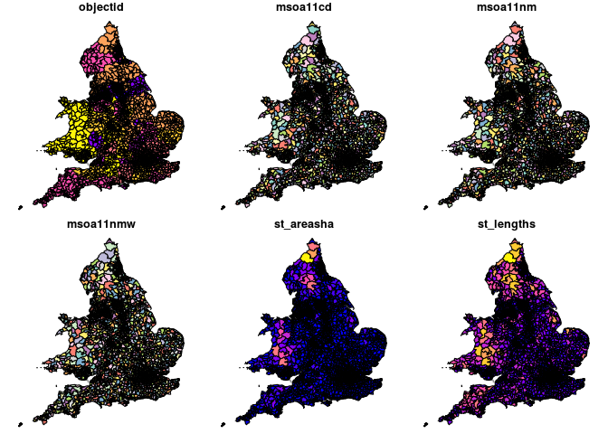
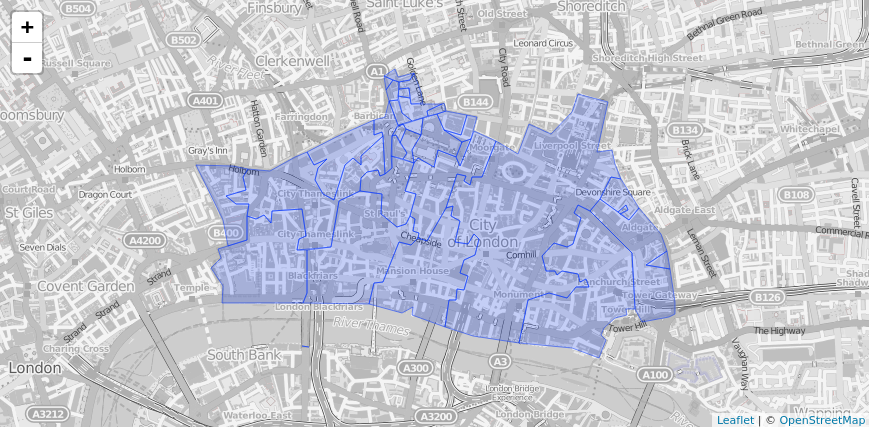
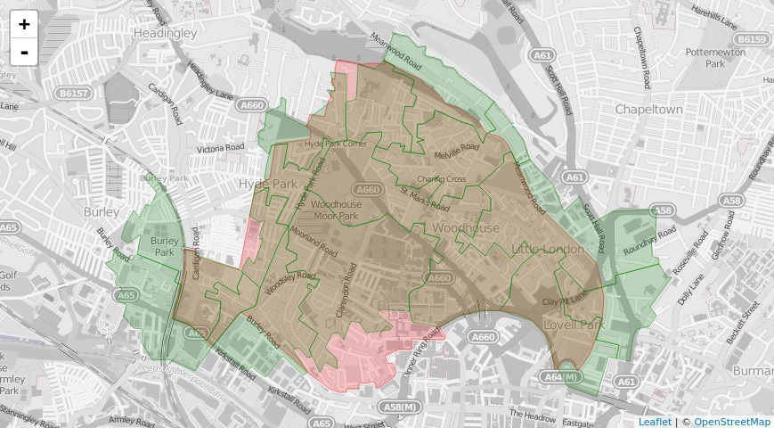

<!-- README.md is generated from README.Rmd. Please edit that file -->
ukboundaries
============

The goal of ukboundaries is to ease access to official geographic UK data. As some in the Free and Open Source Software for Geospatial community (FOSS4G) would say: "geo for all"!

This data is provided under the terms of the Open Government Licence. See <https://www.ons.gov.uk/methodology/geography/licences> for further details.

Installation
------------

You can install ukboundaries from github with:

``` r
# install.packages("devtools")
devtools::install_github("robinlovelace/ukboundaries")
```

Examples
--------

This is a basic example which shows you how to solve a common problem:

``` r
library(ukboundaries)
#> Loading required package: sf
#> Linking to GEOS 3.5.1, GDAL 2.2.1, proj.4 4.9.2, lwgeom 2.3.3 r15473
#> Contains National Statistics data © Crown copyright and database right2017
#> Contains OS data © Crown copyright and database right, 2017
#> See https://www.ons.gov.uk/methodology/geography/licences
plot(msoa2011_vsimple)
```



This example maps the 2011 output areas in the City of London
```
ladcode = "E09000001" # City of London
oacodes = getsubgeographies(ladcode, "OA11")
# Get the OA polygons and draw them
sdf = getspatialdata(oacodes, "Boundaries", "GeneralisedClipped")
leaflet() %>% addProviderTiles(providers$OpenStreetMap.BlackAndWhite, options=tileOptions(opacity=.7)) %>% addPolygons(data=sdf$geometry, weight=1)
```


Here we plot the LSOAs that have population-weighted centroids in a particular ward:

```
library(ukboundaries)
library(sf)
library(leaflet)

# Get all the 2011 LSOAs that intersect* with the Ward containing the University of Leeds
# (* population-weighted centroid is within the ward)
wd16=getfullspatialdata("WD16","Boundaries","FullClipped")
ward=wd16[wd16$wd16nm=="Hyde Park and Woodhouse",] 

# Get all the LSOA codes in Leeds
ladcode = "E08000035" # 
lsoacodes = getsubgeographies(ladcode, "LSOA11")
# Get the LSOA centroids
all_lsoa11=getspatialdata(lsoacodes, "Centroids", "PopulationWeighted")

# Use sf to detemine which intersect the ward
intersects=st_intersects(all_lsoa11$geometry, ward$geometry, sparse=F)
centroids = all_lsoa11[intersects,]

# now get polygons for the intersecting LSOAs
polygons = getspatialdata(centroids$lsoa11cd, "Boundaries", "GeneralisedClipped")

# and plot them overlaid on the ward
leaflet() %>% addProviderTiles(providers$OpenStreetMap.BlackAndWhite, options=tileOptions(opacity=.7)) %>% 
              addPolygons(data=cheap$geometry, weight=1, color="red") %>% 
              addPolygons(data=polygons$geometry, weight=1, color="green")
```

